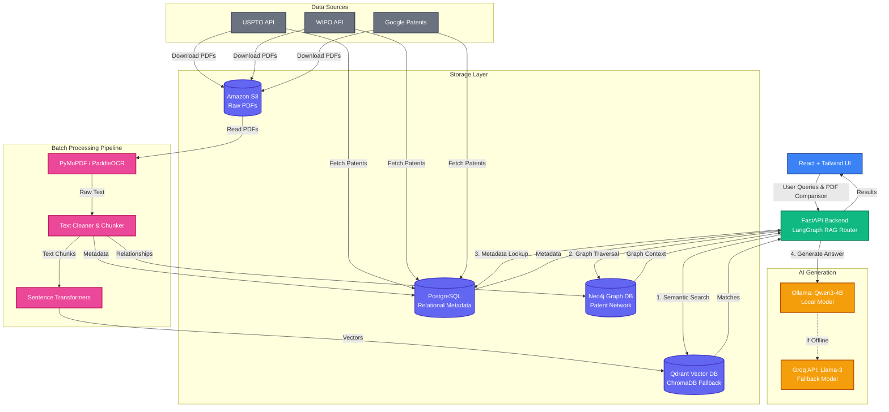

# PatentMind AI: Project Overview

## 1. Project Problem Statement

As the fields of Artificial Intelligence and Machine Learning evolve rapidly, navigating the dense and highly technical landscape of intellectual property (IP) has become increasingly difficult. Researchers, legal teams, and corporations struggle to efficiently search through hundreds of complex patents, identify novel inventions compared to existing prior art, and discover hidden relationships between inventors, companies, and technical classifications.

**PatentMind AI** solves this by providing an enterprise-grade AI Patent Intelligence Platform. It automates the ingestion of raw patent documents from multiple global repositories (USPTO, WIPO, Google Patents), processes them using advanced OCR and natural language processing, and makes them semantically searchable using a Retrieval-Augmented Generation (RAG) pipeline powered by Large Language Models (LLMs).

---

## 2. High-Level Architecture

PatentMind AI is designed as a robust, fault-tolerant microservices architecture orchestrated to handle large-scale data ingestion and real-time AI querying. The architecture follows a strict 15-stage workflow broken into four primary phases:

### System Architecture Diagram

1. **Ingestion & Storage Layer:**
   Connects to global patent APIs, deduplicates records, validates metadata, and safely stores original patent PDFs in Amazon S3. Metadata is persisted in a relational database.
2. **Document Processing Layer (Batch GPU Job):**
   Extracts text from digital PDFs and uses GPU-accelerated OCR for scanned documents. The text is cleaned of noise and intelligently chunked based on patent structure (e.g., separating distinct claims).
3. **Vector & Graph Storage Layer:**
   Chunks are embedded into mathematical vectors and stored in a Vector Database for semantic search. Concurrently, relationships (inventors, assignees, technical classifications) are mapped into a Knowledge Graph.
4. **Retrieval-Augmented Generation (RAG) Layer:**
   When a user submits a natural language query or uploads a PDF for comparison, the system retrieves semantically similar patent chunks, explores the knowledge graph for related context, and synthesizes a highly accurate, cited response using an LLM.

*The system is highly resilient, featuring automatic fallbacks across its database and AI generation layers to ensure uninterrupted service.*

---

## 3. Tech Stack & Explanations

### Backend & Orchestration

* **FastAPI & Uvicorn:** A high-performance Python web framework used to build and serve the backend REST API endpoints, routing data between the UI and the AI pipelines.
* **LangGraph & LangChain:** Frameworks utilized to orchestrate the Retrieval-Augmented Generation (RAG) logic and structure LLM chains.

### AI & Machine Learning Models

* **Ollama (Qwen3-4B):** The primary Local Large Language Model used to synthesize answers, assess novelty, and ensure data privacy by running on-premises.
* **Groq API (Llama 3):** An ultra-fast cloud LLM used as an automatic fallback if the local Ollama service becomes unavailable.
* **sentence-transformers (all-MiniLM-L6-v2):** A GPU-accelerated embedding model used to convert text chunks into high-dimensional vectors for semantic search.
* **PaddleOCR (PP-OCRv4) & PyMuPDF:** Used in batch processing to handle text extraction. PyMuPDF handles native digital text, while PaddleOCR uses computer vision to extract text from scanned patent images.

### Databases & Storage

* **Qdrant:** The primary Vector Database, which stores the vector embeddings and performs lightning-fast similarity searches to find relevant patent chunks.
* **ChromaDB:** A secondary vector database used as an automatic embedded fallback if the Qdrant server is unreachable.
* **Neo4j:** A Graph Database used to build a "Knowledge Graph" of the patent ecosystem, mapping out connections between patents, inventors, assignees, and Cooperative Patent Classification (CPC) codes.
* **PostgreSQL & SQLAlchemy:** The primary relational database (and ORM) used to store structured patent metadata, processing logs, and system states. (Defaults to SQLite if Postgres is offline).
* **Amazon S3:** Cloud object storage used to reliably store the original raw PDF files of the ingested patents.

### Frontend

* **React:** A JavaScript library for building a dynamic, single-page user interface.
* **Tailwind CSS:** A utility-first CSS framework used to rapidly style the web dashboard, ensuring a modern and responsive user experience.
