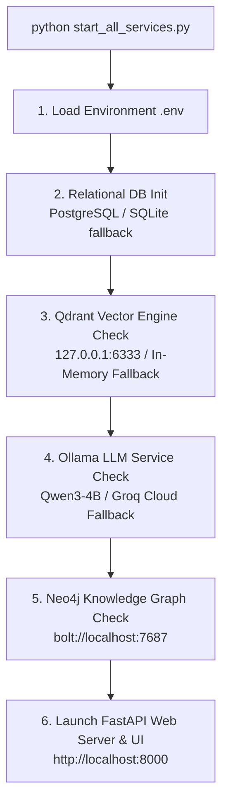

# PatentMind AI — Master Service Startup Guide & Single-File Launcher

This guide explains how to start and orchestrate all PatentMind AI microservices and components using the unified launcher script: **[`start_all_services.py`](file:///c:/Users/Omkar/Downloads/Patent%20Basic/start_all_services.py)**.

---

## Quick Start (One Command)

From the project root directory (`c:\Users\Omkar\Downloads\Patent Basic`), execute:

```bash
python start_all_services.py
```

To run the batch S3 GPU ingestion worker before launching the web server:
```bash
python start_all_services.py --worker
```

---

## System Architecture & Orchestration Flow

When `python start_all_services.py` is invoked, the script automatically executes the following 6-step initialization pipeline:



---

## Detailed Breakdown of Each Layer

### 1. Environment Configuration (`.env`)
- **Location:** Reads both `./patentmind/.env` and `./.env`.
- **Key Variables Configured:**
  - `DATABASE_URL`: Relational DB connection string.
  - `QDRANT_HOST` / `QDRANT_PORT`: Vector DB endpoint (`127.0.0.1:6333` or GPU server `192.168.6.50:6333`).
  - `OLLAMA_BASE_URL`: Local or remote Ollama endpoint (`http://127.0.0.1:11434`).
  - `GROQ_API_KEY`: API key for automatic Groq cloud fallback (`llama-3.3-70b-versatile`).
  - `NEO4J_URI` / `NEO4J_USER` / `NEO4J_PASSWORD`: Neo4j graph database credentials.

---

### 2. Relational Database Layer (`init_db`)
- **Action:** Initializes SQLAlchemy models (`Patent`, `EmbeddingsMeta`, `ProcessingLog`).
- **Primary:** PostgreSQL database if specified in `DATABASE_URL`.
- **Fallback:** Automatic SQLite database at `sqlite:///./patentmind_fallback.db` if Postgres is unavailable.

---

### 3. Qdrant Vector Database Engine
- **Action:** Connects to Qdrant instance via `qdrant_client`.
- **Collection:** Automatically creates/verifies the `patent_chunks` collection (384-dimension Cosine distance vectors).
- **Fallback:** If remote host `192.168.6.50:6333` or local `127.0.0.1:6333` is unreachable, `VectorStore` initializes an in-memory Qdrant instance (`QdrantClient(":memory:")`), allowing query and testing execution without crashes.

---

### 4. Ollama LLM Service & Dual-Fallback Router
- **Action:** Checks connectivity to `OLLAMA_BASE_URL` (`http://127.0.0.1:11434`) for model `qwen2.5:3b` / `qwen3-4b`.
- **Subprocess Launch:** If running locally and Ollama is not active, attempts to start `ollama serve` in the background automatically.
- **Dual-Fallback Architecture:**
  1. Primary: Ollama (Qwen3-4B on local/GPU server)
  2. Secondary: Groq Cloud API (`llama-3.3-70b-versatile`)
  3. Simulation Fallback: Structured domain simulation if offline

---

### 5. Neo4j Knowledge Graph Engine
- **Action:** Verifies connectivity via `neo4j.driver` to `bolt://localhost:7687`.
- **Features:** Graph traversal for patent networks, shared co-inventors, assignee portfolios, and CPC code classifications.
- **Fallback:** Gracefully handles offline Neo4j by returning empty/simulated network structures without interrupting vector RAG operations.

---

### 6. FastAPI Web Server & Single-Page Application Host
- **Action:** Starts Uvicorn ASGI server on `http://0.0.0.0:8000`.
- **Endpoints Mounted:**
  - `POST /api/query`: Natural language RAG search pipeline.
  - `POST /api/compare-pdf`: Unified PDF comparison (Vector similarity + Graph traversal + Novelty synthesis).
  - `GET /api/patents`: Paginated patent database browser.
  - `GET /api/patents/{pn}`: Full patent metadata detail modal.
  - `GET /api/stats`: Real-time system metrics & graph breakdown.
  - `GET /api/system-status`: Live microservice connectivity status.
  - `GET /`: Serves the Single-Page Application from `frontend/dist/index.html` (Terracotta theme).

---

## Service Commands Reference Table

If you need to manage individual services manually:

| Service | Manual Command / Endpoint | Default Port |
|---------|---------------------------|--------------|
| Master Orchestrator | `python start_all_services.py` | 8000 |
| FastAPI Web Server | `python -m uvicorn patentmind.api.main:app --port 8000` | 8000 |
| Qdrant Vector Engine | `qdrant.exe` or `docker run -p 6333:6333 qdrant/qdrant` | 6333 |
| Ollama Service | `ollama serve` | 11434 |
| Neo4j Graph DB | `neo4j console` or Docker container | 7687 |
| Batch S3 GPU Worker | `python gpu_worker.py` | Standalone |

---

## Verification & Health Check

Once `start_all_services.py` is running:
1. Open **`http://localhost:8000`** in your web browser.
2. Check the **System Status Panel** in the bottom-left sidebar of the UI:
   - Green dots indicate active services (Qdrant, Qwen3-4B, Neo4j).
   - Amber dot indicates standby service (Groq API fallback).
3. Run a query in **AI Query** tab or upload a sample PDF in **Compare PDF** tab to verify end-to-end processing.
