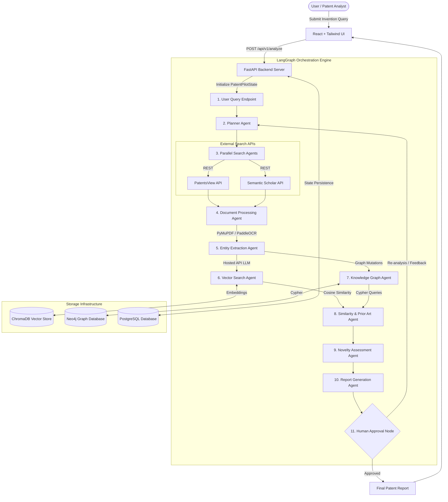
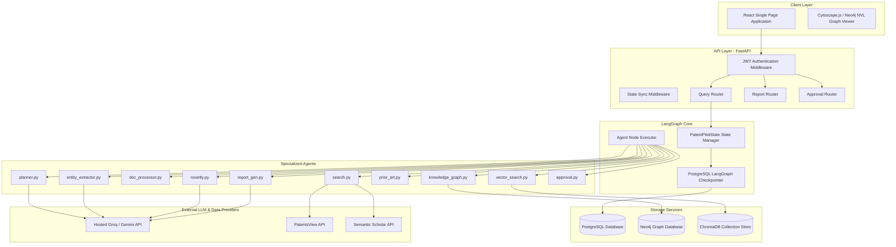
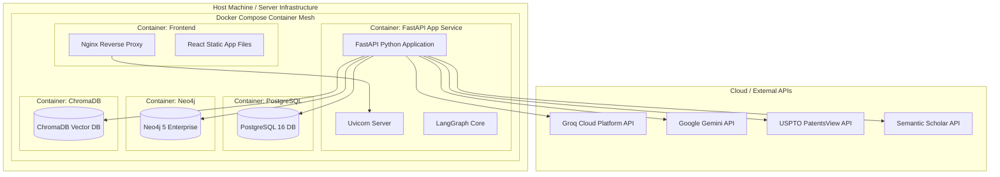
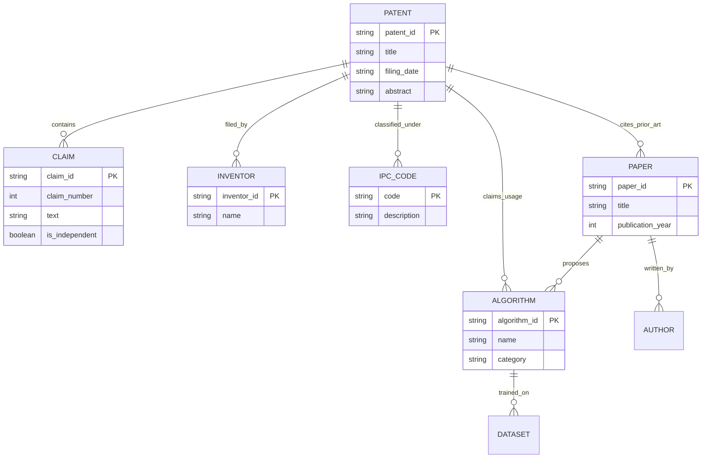
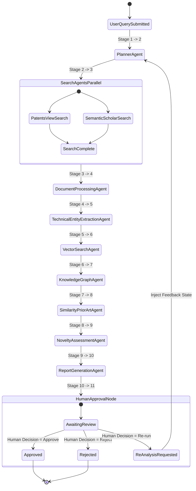
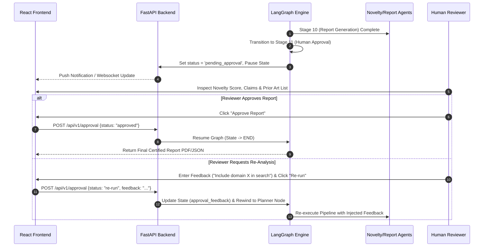
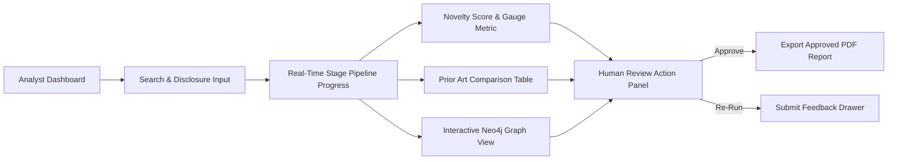
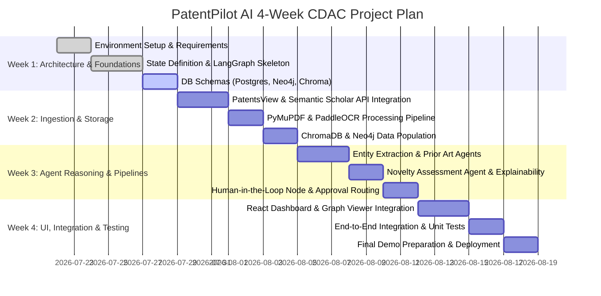

# Software Architecture Document
## PatentPilot AI: Autonomous Multi-Agent Patent Intelligence Platform for Artificial Intelligence & Emerging Technologies

---

### Executive Summary & Metadata
- **Project Title:** PatentPilot AI
- **System Classification:** Multi-Agent AI Decision Support & Patent Intelligence Platform
- **Team Size:** 6-person CDAC Engineering Team (4-Week Build Cycle)
- **Document Version:** 1.0.0 (Production Architecture Specification)
- **Target Domain:** Artificial Intelligence, Machine Learning, LLMs, Agentic AI, RAG, Computer Vision, NLP, Generative AI, Edge AI, AI Infrastructure, Robotics, Autonomous Systems, and Emerging Tech.

---

## 1. Executive Summary
**PatentPilot AI** is an enterprise-grade, multi-agent patent intelligence platform designed to replace legacy keyword-based patent search tools with an autonomous, graph-enhanced, LLM-powered decision support system. Grounded in a locked 11-stage LangGraph workflow, PatentPilot AI coordinates specialized AI agents that extract technical entities, query multi-source APIs (PatentsView and Semantic Scholar), parse text and OCR scanned PDFs, perform vector similarity search via ChromaDB, construct domain knowledge graphs in Neo4j, analyze prior art overlap, and generate explainable novelty assessment reports with mandatory human-in-the-loop approval.

Designed specifically for minimum local compute constraints, all generative reasoning is offloaded to hosted API infrastructure (Groq/Gemini), while fast vector embeddings (`sentence-transformers/all-MiniLM-L6-v2`) and graph queries run locally inside containerized microservices. PatentPilot AI delivers high-precision novelty scoring, prior art identification, and technical claim visual graph mapping for R&D teams, IP attorneys, and technology analysts.

---

## 2. Problem Statement
Evaluating patents in fast-evolving fields like Artificial Intelligence and Emerging Technologies presents unprecedented technical complexity. Modern AI inventions rely on nuanced algorithmic variations, model architectures, dataset training procedures, and mathematical optimizations. Traditional IP tools rely heavily on rigid Boolean queries and manual classification codes (IPC/CPC), causing high rates of false negatives and requiring hundreds of hours of manual attorney review. Furthermore, academic research preprints (e.g., arXiv, Semantic Scholar) often precede patent filings by months or years, yet traditional patent databases fail to cross-reference scientific literature with patent claims dynamically.

---

## 3. Existing Problems
1. **Keyword Ambiguity:** Semantic variations (e.g., "self-attention mechanism" vs. "contextual token weighting") cause keyword queries to miss critical prior art.
2. **Disconnected Literature & Patent Silos:** Patent databases (USPTO, Espacenet, WIPO) and scientific preprint servers operate in complete isolation.
3. **Scanned PDF Parsing Bottlenecks:** Older or international patent filings contain unsearchable scanned bitmap images and diagrams.
4. **Black-Box Novelty Assessments:** Existing search software provides no explainable justification or node-level claim mappings to explain why an invention is considered novel or non-obvious.
5. **High Legal Expenses:** Patent attorneys spend upwards of $5,000–$15,000 per patent search to manually cross-reference prior art documents.

---

## 4. Existing Solutions
- **Legacy Patent Search Databases:** Google Patents, USPTO TSDR, Espacenet, WIPO PATENTSCOPE.
- **Commercial IP Analytics Platforms:** Derwent Innovation, PatentSight, LexisNexis PatentSight Analytics.
- **Generic Semantic Search Engines:** Basic RAG implementations over raw text embeddings.

---

## 5. Limitations of Existing Systems
- **No Agentic Autonomy:** Existing systems require human experts to formulate queries, download PDFs, summarize claims, and assemble spreadsheets manually.
- **Lack of Knowledge Graph Context:** Vector-only RAG systems suffer from semantic drift and fail to represent multi-hop relationships (e.g., Inventor $\rightarrow$ Assignee $\rightarrow$ Specific Claimed Algorithm $\rightarrow$ Prior Paper).
- **Absence of Explainable Scoring:** Legacy tools offer no breakdown of novelty scores cited against exact line snippets or graph edges.
- **Lack of Human-in-the-Loop Safeguards:** Automated tools either present unverified hallucination-prone AI summaries or raw data without approval controls.

---

## 6. Proposed Solution
PatentPilot AI introduces a state-of-the-art Multi-Agent Architecture orchestrated via LangGraph. The platform executes an 11-stage deterministic pipeline:
1. **User Query API Endpoint** receives the natural language invention disclosure.
2. **Planner Agent** decomposes the disclosure into target technical keywords and search intent.
3. **Search Agents (Parallel)** query PatentsView API and Semantic Scholar API concurrently.
4. **Document Processing Agent** parses text PDFs via PyMuPDF and extracts unsearchable scanned content using PaddleOCR fallback.
5. **Technical Entity Extraction Agent** extracts structured claims, algorithms, datasets, inventors, and IPC/CPC codes.
6. **Vector Search Agent** generates embeddings via `sentence-transformers` and performs top-$k$ nearest neighbor search in ChromaDB.
7. **Knowledge Graph Agent** ingests entities into Neo4j to model structural relationships.
8. **Similarity & Prior Art Agent** calculates semantic overlap and identifies prior art candidates.
9. **Novelty Assessment Agent** evaluates claims against prior art to output a 0–100 novelty score with cited evidence.
10. **Report Generation Agent** synthesizes an executive decision report.
11. **Human Approval Node** pauses execution for human review (Approve / Reject / Request Re-analysis).

---

## 7. Project Objectives
- Achieve **>90% recall** in identifying relevant prior art across patent and academic literature.
- Reduce prior art analysis turnaround time from **20 hours to under 3 minutes**.
- Provide 100% explainable novelty scoring backed by exact claim citations and Neo4j visual subgraphs.
- Guarantee strict human oversight via an interactive Human-in-the-Loop review system before report finalization.

---

## 8. Functional Requirements
- **FR-1 Query Decomposition:** Must parse natural language input into key concepts, IPC/CPC categories, and search keywords.
- **FR-2 Multi-Source Aggregation:** Must execute parallel queries against PatentsView API (patents) and Semantic Scholar API (papers).
- **FR-3 Hybrid Document Ingestion:** Must handle clean text PDFs using PyMuPDF and automatically trigger PaddleOCR for scanned raster pages.
- **FR-4 Entity & Claim Extraction:** Must extract algorithms, model architectures, hyper-parameters, datasets, inventors, and CPC codes into structured JSON schemas.
- **FR-5 Vector Indexing & Search:** Must index document chunks into ChromaDB and execute cosine similarity searches.
- **FR-6 Graph Modeling:** Must construct and update Neo4j nodes (`Patent`, `Paper`, `Inventor`, `Algorithm`, `Dataset`, `Claim`) and edges (`CLAIMS`, `USES_ALGORITHM`, `CITES`, `AUTHORED_BY`).
- **FR-7 Explainable Novelty Evaluation:** Must compute a 0–100 Novelty Index based on claim overlap matrices and output structured justifications citing prior art snippets.
- **FR-8 Human-in-the-Loop Governance:** Must allow reviewers to approve, reject, or inject feedback to trigger re-analysis loops.

---

## 9. Non-Functional Requirements
- **NFR-1 Latency:** Pipeline end-to-end processing (excluding human approval wait time) must complete within <180 seconds for up to 50 retrieved documents.
- **NFR-2 Low Compute Efficiency:** Main LLM inference must execute via hosted Groq/Gemini APIs; local GPU requirements must remain under 4GB VRAM (limited to sentence-transformers and PaddleOCR).
- **NFR-3 Reliability & Resilience:** Pipeline stages must incorporate exponential backoff retry logic and fallback graceful degrading.
- **NFR-4 Data Integrity & Auditing:** All intermediate agent outputs must be persisted in PostgreSQL with full execution trace auditing.
- **NFR-5 Security & Privacy:** All environment keys stored in `.env`; zero hardcoded credentials; JWT-based API access.

---

## 10. System Architecture
PatentPilot AI employs a decoupled Microservices & Multi-Agent Architecture consisting of:
1. **Frontend Layer:** React SPA with Tailwind CSS for visualization, graph rendering, and human review.
2. **API Gateway Layer:** FastAPI application serving REST endpoints and managing request routing.
3. **Agent Orchestration Engine:** LangGraph executing deterministic state graph transitions across shared state `PatentPilotState`.
4. **Data Infrastructure Layer:**
   - **PostgreSQL:** Relational store for users, run metadata, state history, and report logs.
   - **Neo4j:** Graph database for structural relationship queries and citation network traversal.
   - **ChromaDB:** Vector store for dense embedding retrieval.
5. **External API Integrations:** Hosted LLM APIs (Groq/Gemini), PatentsView REST API, Semantic Scholar REST API.

---

## 11. High-Level Architecture Diagram



---

## 12. Low-Level Architecture



---

## 13. Component Diagram

```mermaid
componentStyle
component [React Frontend SPA] as FrontendUI
component [FastAPI Gateway] as APIGateway
component [LangGraph Workflow Engine] as WorkflowEngine
component [Document Ingestion Service] as IngestionService
component [PyMuPDF Parser] as MuPDF
component [PaddleOCR Engine] as OCR
component [SentenceTransformer Embedder] as Embedder
component [ChromaDB Vector Adapter] as ChromaAdapter
component [Neo4j Graph Adapter] as Neo4jAdapter
component [Groq/Gemini LLM Client] as LLMClient

FrontendUI --> APIGateway : HTTP / WebSockets
APIGateway --> WorkflowEngine : Execute Graph Run
WorkflowEngine --> IngestionService : Raw PDFs / Papers
IngestionService --> MuPDF : Text Parsing
IngestionService --> OCR : Raster Parsing Fallback
WorkflowEngine --> Embedder : Text Chunks
Embedder --> ChromaAdapter : Dense Vectors
WorkflowEngine --> Neo4jAdapter : Cypher Queries
WorkflowEngine --> LLMClient : Entity Extraction / Novelty Reasoning
```

---

## 14. Deployment Diagram



---

## 15. Database Architecture
PatentPilot AI employs a hybrid polyglot persistence model:
1. **Relational Database (PostgreSQL):** Stores structured operational records (User accounts, Search Sessions, Agent Workflow State Snapshots, Human Review Log History, Final Assembled Reports).
2. **Graph Database (Neo4j):** Stores interconnected domain entities and topological network structures.
3. **Vector Database (ChromaDB):** Stores dense vector embeddings representing document chunks for semantic similarity search.

---

## 16. Knowledge Graph Architecture
The Neo4j Knowledge Graph represents technical claims and scientific concepts as an interconnected graph network.



---

## 17. Vector Database Architecture
- **Vector Database Engine:** ChromaDB 1.0.20
- **Embedding Model:** `sentence-transformers/all-MiniLM-L6-v2` (384-dimensional dense vectors)
- **Distance Metric:** Cosine Distance ($1 - \text{cosine\_similarity}$)
- **Chunking Strategy:** Recursive Character Text Splitting (Chunk size: 512 tokens, Overlap: 64 tokens)
- **Collection Name:** `patent_pilot_chunks`
- **Metadata Fields:** `source_id`, `source_type` (`patent` | `paper`), `title`, `section` (`abstract` | `claims` | `description`), `chunk_index`.

---

## 18. Multi-Agent Workflow



---

## 19. End-to-End User Workflow
1. User enters natural language disclosure: *"A system for multi-modal agent planning using graph search and transformer memory."*
2. System initializes state session in PostgreSQL and invokes LangGraph execution.
3. System plans query strategies and retrieves top 10 matching patents and top 10 matching research papers.
4. Document Processor extracts clean text, running PaddleOCR if a PDF lacks text streams.
5. Entity Extractor structures claims, algorithms (e.g., Graph Search, Transformer Attention), and CPC codes.
6. System indexes text chunks into ChromaDB and generates Neo4j graph nodes.
7. Similarity Agent queries ChromaDB and Neo4j, returning top prior art matches.
8. Novelty Agent scores overall novelty (e.g., 78/100) and writes detailed breakdown of overlapping vs. distinct claims.
9. Report Generator constructs a structured report.
10. System pauses at Stage 11 (Human Approval Node) and notifies user on UI.
11. User inspects prior art matches, graph view, and novelty breakdown.
12. User clicks **Approve** (or submits feedback to trigger re-analysis).

---

## 20. Shared Agent State
The central `PatentPilotState` is defined as a `TypedDict` in `state.py`:

```python
class PatentPilotState(TypedDict, total=False):
    user_query: str
    search_keywords: List[str]
    patent_results: List[Dict[str, Any]]
    research_papers: List[Dict[str, Any]]
    raw_documents: List[Dict[str, Any]]
    technical_entities: List[Dict[str, Any]]
    embeddings_ready: bool
    similarity_scores: List[Dict[str, Any]]
    knowledge_graph_id: Optional[str]
    prior_art: List[Dict[str, Any]]
    novelty_score: Optional[int]
    novelty_explanation: Optional[str]
    report: Optional[Dict[str, Any]]
    approval_status: Optional[str]  # 'pending' | 'approved' | 'rejected' | 're-run'
    approval_feedback: Optional[str]
```

---

## 21. Agent Communication Flow
Agents do not communicate via unstructured direct socket connections or direct RPCs. All communication is mediated strictly through state mutations governed by **LangGraph**. Each stage function receives a snapshot of `PatentPilotState`, executes its specialized logic, and returns a updated dictionary containing only its output key mutations. LangGraph updates the state in memory and persists the state checkpoint into PostgreSQL before signaling the subsequent stage.

---

## 22. AI Agent Responsibilities
| Stage # | Agent Name | File Path | Core Functionality | Input State Key | Output State Key |
|---|---|---|---|---|---|
| 1 | User Query | `api/routes.py` | Receives raw user disclosure query | None | `user_query` |
| 2 | Planner Agent | `agents/planner.py` | Extracts 3-6 precise technical search keywords & IPC targets | `user_query` | `search_keywords` |
| 3 | Search Agents | `agents/search.py` | Queries PatentsView and Semantic Scholar REST APIs in parallel | `search_keywords` | `patent_results`, `research_papers` |
| 4 | Document Processing Agent | `agents/doc_processor.py` | Extracts text via PyMuPDF; falls back to PaddleOCR for scanned PDFs | `patent_results`, `research_papers` | `raw_documents` |
| 5 | Entity Extraction Agent | `agents/entity_extractor.py` | Uses LLM to extract algorithms, claims, inventors, and datasets | `raw_documents` | `technical_entities` |
| 6 | Vector Search Agent | `agents/vector_search.py` | Computes embeddings via `sentence-transformers` and queries ChromaDB | `raw_documents` | `embeddings_ready`, `similarity_scores` |
| 7 | Knowledge Graph Agent | `agents/knowledge_graph.py` | Builds entity nodes and relationship edges in Neo4j | `technical_entities` | `knowledge_graph_id` |
| 8 | Similarity & Prior Art Agent | `agents/prior_art.py` | Merges ChromaDB similarity and Neo4j graph proximity to isolate prior art | `similarity_scores`, `knowledge_graph_id` | `prior_art` |
| 9 | Novelty Assessment Agent | `agents/novelty.py` | Computes 0–100 novelty score with cited claim overlap justifications | `user_query`, `prior_art` | `novelty_score`, `novelty_explanation` |
| 10 | Report Generation Agent | `agents/report_gen.py` | Assembles final structured JSON report dictionary | All previous keys | `report` |
| 11 | Human Approval Node | `agents/approval.py` | Manages human review state ('approved', 'rejected', 're-run') | `report` | `approval_status`, `approval_feedback` |

---

## 23. Human Approval Workflow



---

## 24. RAG Pipeline
The Retrieval-Augmented Generation (RAG) pipeline combines dense vector similarity search with structured knowledge graph traversal:
1. **Retrieval Stage 1 (Vector RAG):** The user's query is embedded using `sentence-transformers/all-MiniLM-L6-v2` and searched against ChromaDB to find the top $k=20$ document chunks.
2. **Retrieval Stage 2 (Graph RAG):** Identified patent/paper IDs are passed to Neo4j to retrieve 2-hop neighborhood subgraphs (e.g., related algorithms, claimed datasets, and co-inventors).
3. **Context Fusion:** Vector snippets and graph context triples are formatted into a unified prompt context.
4. **LLM Generation:** The context is sent to the hosted API (Groq/Gemini) to evaluate claim novelty without hallucinations.

---

## 25. OCR Pipeline
1. Input document (PDF) is received by `doc_processor.py`.
2. PyMuPDF (`fitz`) attempts direct text extraction per page.
3. If extracted character count per page is $<50$ characters, the page is flagged as a scanned raster image.
4. Raster pages are converted to RGB images (`Pillow` / `opencv-python`).
5. PaddleOCR (`paddleocr.PaddleOCR`) is invoked on the page image to extract bounding boxes and text strings.
6. Extracted text from PyMuPDF and PaddleOCR is combined into normalized text blocks in `raw_documents`.

---

## 26. Patent Processing Pipeline
- Input: Patent ID list from PatentsView search results.
- Ingestion: Download structured patent metadata (Title, Abstract, Filing Date, Inventors, IPC Codes, PDF link).
- Parsing: Extract text sections: Abstract, Claims 1-N, Detailed Description.
- Normalization: Remove legal boilerplate text ("What is claimed is...", "Background of the invention").
- Output Format: Standardized JSON dictionary added to `raw_documents` in `PatentPilotState`.

---

## 27. Research Paper Processing Pipeline
- Input: Paper ID list from Semantic Scholar API.
- Ingestion: Fetch DOI, Title, Abstract, Publication Year, Authors, TLDR, PDF URL.
- Parsing: Read open-access PDF via PyMuPDF or extract abstract/TLDR text streams.
- Mapping: Align paper methodology to corresponding patent claim components.
- Output Format: Standardized JSON record appended to `raw_documents`.

---

## 28. Knowledge Graph Pipeline
1. Read `technical_entities` from `PatentPilotState`.
2. Open Neo4j session using `neo4j.GraphDatabase.driver`.
3. Execute Cypher queries using `MERGE` clauses to prevent duplicate node creation:
   - `MERGE (p:Patent {patent_id: entity.source_id})`
   - `MERGE (a:Algorithm {name: entity.algorithm})`
   - `MERGE (p)-[:CLAIMS_USAGE]->(a)`
4. Store graph session run identifier in `knowledge_graph_id`.

---

## 29. Citation Analysis Pipeline
1. Extract forward and backward citations from PatentsView metadata and Semantic Scholar references.
2. Construct citation subgraphs in Neo4j (`(p1:Patent)-[:CITES]->(p2:Patent)`).
3. Calculate Citation Density and H-Index influence across prior art networks.
4. Pass citation clusters to the Novelty Assessment Agent to highlight foundational baseline patents.

---

## 30. Similarity Search Pipeline
1. Compute vector embeddings for input query.
2. Perform K-Nearest Neighbors (KNN) query in ChromaDB.
3. Compute hybrid similarity score:
   $$\text{Score} = \alpha \cdot \text{CosineSim}(\mathbf{v}_q, \mathbf{v}_d) + \beta \cdot \text{JaccardSim}(\text{Entities}_q, \text{Entities}_d)$$
   where $\alpha = 0.7$ and $\beta = 0.3$.
4. Sort and filter documents exceeding similarity threshold ($>0.65$).

---

## 31. Prior Art Analysis Pipeline
1. Aggregate candidate documents from Similarity Search Pipeline.
2. Map individual elements of user query disclosure to specific independent claims of candidate patents.
3. Identify overlap matrix: Full Match, Partial Match, No Match.
4. Flag high-risk prior art candidates into `prior_art` key in `PatentPilotState`.

---

## 32. Novelty Assessment Pipeline
1. Receive query disclosure and high-risk prior art list.
2. Invoke hosted LLM (Groq/Gemini) with structured instruction prompt:
   - Identify novel elements not present in prior art.
   - Evaluate non-obviousness under 35 U.S.C. § 103 criteria.
   - Assign integer score $0 \le N \le 100$ (0 = Anticipated/Not Novel, 100 = Highly Novel).
3. Output `novelty_score` and markdown `novelty_explanation`.

---

## 33. Report Generation Pipeline
1. Aggregate all state fields: query, search keywords, entity maps, similarity rankings, prior art list, novelty score, and explanation.
2. Structure JSON payload matching report schema.
3. Render interactive HTML/Markdown view in frontend and generate downloadable PDF report.

---

## 34. Dashboard Workflow



---

## 35. API Design
FastAPI REST API following OpenAPI 3.0 specification:
- `POST /api/v1/analyze`: Submit new invention query.
- `GET /api/v1/status/{session_id}`: Fetch pipeline stage status.
- `GET /api/v1/report/{session_id}`: Fetch generated report.
- `POST /api/v1/approval`: Submit human approval decision ('approved', 'rejected', 're-run').
- `GET /api/v1/graph/{session_id}`: Fetch Neo4j graph nodes and edges for visualization.

---

## 36. Backend Folder Structure
```
Antigravity Patent/
├── AGENTS.md                  # Project rules & locked workflow specs
├── state.py                   # PatentPilotState TypedDict definition
├── graph.py                   # 11-stage LangGraph workflow construction
├── requirements.txt           # Exact pinned dependencies
├── .env.example               # Environment variables template
├── alembic.ini                # Alembic DB migration config
├── docker-compose.yml         # Container orchestration manifest
├── agents/                    # Individual agent modules per stage
│   ├── __init__.py
│   ├── planner.py             # Stage 2: Keyword planner agent
│   ├── search.py              # Stage 3: PatentsView + S2 search agent
│   ├── doc_processor.py       # Stage 4: PyMuPDF + PaddleOCR agent
│   ├── entity_extractor.py    # Stage 5: Entity extraction agent
│   ├── vector_search.py       # Stage 6: ChromaDB vector search agent
│   ├── knowledge_graph.py     # Stage 7: Neo4j knowledge graph agent
│   ├── prior_art.py           # Stage 8: Similarity & prior art agent
│   ├── novelty.py             # Stage 9: Novelty assessment agent
│   ├── report_gen.py          # Stage 10: Report generation agent
│   └── approval.py            # Stage 11: Human approval node
├── api/                       # FastAPI Web Layer
│   ├── __init__.py
│   ├── main.py                # App entrypoint & CORS config
│   ├── routes.py              # Endpoint route definitions
│   └── schemas.py             # Pydantic request/response schemas
├── db/                        # Database connection & SQLAlchemy models
│   ├── __init__.py
│   ├── database.py            # DB engine session manager
│   ├── models.py              # ORM models (User, Run, State, ApprovalLog)
│   ├── neo4j_client.py        # Neo4j driver connection helper
│   └── chroma_client.py       # ChromaDB collection connection helper
├── ingestion/                 # Document ingestion utilities
│   ├── pdf_parser.py          # PyMuPDF wrapper
│   └── ocr_engine.py          # PaddleOCR fallback engine
├── retrieval/                 # Search API integrations
│   ├── patentsview.py         # PatentsView API REST client
│   └── semantic_scholar.py    # Semantic Scholar API REST client
├── scripts/                   # Utility and setup scripts
└── tests/                     # Verification test suites per stage
```

---

## 37. Frontend Folder Structure
```
frontend/
├── public/
│   └── favicon.ico
├── src/
│   ├── components/
│   │   ├── Header.jsx          # Application header & navigation
│   │   ├── QueryForm.jsx       # Invention disclosure input form
│   │   ├── PipelineStatus.jsx  # Real-time 11-stage progress tracker
│   │   ├── NoveltyGauge.jsx    # SVG radial novelty score indicator
│   │   ├── PriorArtTable.jsx   # Interactive prior art comparison matrix
│   │   ├── GraphViewer.jsx     # Neo4j interactive graph visualization
│   │   ├── ApprovalPanel.jsx   # Approve / Reject / Re-run action panel
│   │   └── ReportView.jsx      # Rendered markdown/JSON report view
│   ├── pages/
│   │   ├── Dashboard.jsx       # Main analysis dashboard page
│   │   ├── History.jsx         # Saved analysis runs history
│   │   └── Settings.jsx        # API keys and system configuration
│   ├── services/
│   │   └── api.js              # Axios HTTP client API calls
│   ├── App.jsx                 # Root component & router
│   ├── main.jsx                # React entry point
│   └── index.css               # Tailwind CSS imports & custom styles
├── package.json
├── tailwind.config.js
└── vite.config.js
```

---

## 38. Database Schema Overview
The storage layer coordinates three distinct databases:
1. **PostgreSQL:** Transactional and state history persistence.
2. **Neo4j:** Graph entities and relationships.
3. **ChromaDB:** Unstructured text embeddings.

---

## 39. PostgreSQL Tables

```sql
-- Users Table
CREATE TABLE users (
    id UUID PRIMARY KEY DEFAULT gen_random_uuid(),
    email VARCHAR(255) UNIQUE NOT NULL,
    hashed_password VARCHAR(255) NOT NULL,
    full_name VARCHAR(255),
    role VARCHAR(50) DEFAULT 'analyst',
    created_at TIMESTAMP WITH TIME ZONE DEFAULT CURRENT_TIMESTAMP
);

-- Analysis Runs Table
CREATE TABLE analysis_runs (
    id UUID PRIMARY KEY DEFAULT gen_random_uuid(),
    user_id UUID REFERENCES users(id),
    user_query TEXT NOT NULL,
    status VARCHAR(50) NOT NULL DEFAULT 'pending', -- pending, processing, awaiting_approval, approved, rejected
    novelty_score INT,
    created_at TIMESTAMP WITH TIME ZONE DEFAULT CURRENT_TIMESTAMP,
    updated_at TIMESTAMP WITH TIME ZONE DEFAULT CURRENT_TIMESTAMP
);

-- Workflow State History Table (LangGraph Checkpoints)
CREATE TABLE state_checkpoints (
    id UUID PRIMARY KEY DEFAULT gen_random_uuid(),
    run_id UUID REFERENCES analysis_runs(id) ON DELETE CASCADE,
    stage_name VARCHAR(100) NOT NULL,
    state_json JSONB NOT NULL,
    created_at TIMESTAMP WITH TIME ZONE DEFAULT CURRENT_TIMESTAMP
);

-- Human Approval Logs
CREATE TABLE approval_logs (
    id UUID PRIMARY KEY DEFAULT gen_random_uuid(),
    run_id UUID REFERENCES analysis_runs(id) ON DELETE CASCADE,
    reviewer_id UUID REFERENCES users(id),
    status VARCHAR(50) NOT NULL, -- approved, rejected, re-run
    feedback TEXT,
    created_at TIMESTAMP WITH TIME ZONE DEFAULT CURRENT_TIMESTAMP
);
```

---

## 40. Neo4j Schema
- **Node Labels:**
  - `:Patent {patent_id: String, title: String, abstract: String, filing_date: String}`
  - `:Paper {paper_id: String, title: String, publication_year: Integer}`
  - `:Algorithm {name: String, category: String}`
  - `:Inventor {name: String}`
  - `:IPC {code: String, description: String}`
- **Relationships:**
  - `(:Patent)-[:CLAIMS_ALGORITHM]->(:Algorithm)`
  - `(:Patent)-[:FILED_BY]->(:Inventor)`
  - `(:Patent)-[:CLASSIFIED_AS]->(:IPC)`
  - `(:Patent)-[:CITES_PRIOR_ART]->(:Patent)`
  - `(:Patent)-[:CITES_PAPER]->(:Paper)`
  - `(:Paper)-[:PROPOSES_ALGORITHM]->(:Algorithm)`

---

## 41. ChromaDB Collections
- **Collection Name:** `patent_pilot_chunks`
- **Embedding Dimensions:** 384
- **Distance Function:** `cosine`
- **Document Payload:** Cleaned text chunk string
- **Metadata Structure:**
  ```json
  {
    "run_id": "9b1deb4d-3b7d-4bad-9bdd-2b0d7b3dcb6d",
    "source_id": "US-11234567-B2",
    "source_type": "patent",
    "title": "Method for Transformer Attention",
    "chunk_index": 3
  }
  ```

---

## 42. REST APIs Specification
### `POST /api/v1/analyze`
- **Request Body:**
  ```json
  {
    "query": "A neural network system utilizing graph attention for patent claim analysis"
  }
  ```
- **Response (202 Accepted):**
  ```json
  {
    "run_id": "9b1deb4d-3b7d-4bad-9bdd-2b0d7b3dcb6d",
    "status": "processing",
    "current_stage": "user_query"
  }
  ```

### `GET /api/v1/status/{run_id}`
- **Response (200 OK):**
  ```json
  {
    "run_id": "9b1deb4d-3b7d-4bad-9bdd-2b0d7b3dcb6d",
    "status": "awaiting_approval",
    "current_stage": "human_approval",
    "completed_stages": [
      "user_query", "planner", "search", "document_processing",
      "entity_extraction", "vector_search", "knowledge_graph",
      "similarity_prior_art", "novelty_assessment", "report_generation"
    ]
  }
  ```

### `POST /api/v1/approval`
- **Request Body:**
  ```json
  {
    "run_id": "9b1deb4d-3b7d-4bad-9bdd-2b0d7b3dcb6d",
    "status": "re-run",
    "feedback": "Focus more specifically on graph transformer claims."
  }
  ```
- **Response (200 OK):**
  ```json
  {
    "run_id": "9b1deb4d-3b7d-4bad-9bdd-2b0d7b3dcb6d",
    "status": "processing",
    "message": "Graph rewound to Planner agent with updated feedback."
  }
  ```

---

## 43. Authentication Flow
1. User submits login credentials (`POST /api/v1/auth/login`).
2. Server validates credentials against `users` table in PostgreSQL.
3. Server generates signed JWT token containing `user_id`, `role`, and expiration timestamp (8 hours).
4. Client stores JWT in `HttpOnly` cookie or secure storage.
5. All subsequent requests include `Authorization: Bearer <token>` header, validated by FastAPI `auth_middleware`.

---

## 44. Logging Strategy
- **Framework:** `structlog` Python library for structured JSON logging.
- **Log Levels:** `INFO` for state transitions, `WARNING` for API rate limits / PaddleOCR fallbacks, `ERROR` for agent execution failures.
- **LangSmith Tracing:** Full tracing enabled via `LANGCHAIN_TRACING_V2=true` in `.env` to capture exact prompt inputs, LLM completion outputs, latency metrics, and token counts per stage.

---

## 45. Monitoring
- **Health Checks:** `/healthz` endpoint verifying PostgreSQL, Neo4j, and ChromaDB availability.
- **Metrics Tracked:**
  - Pipeline Execution Latency per stage.
  - LLM API call duration & cost metrics (Groq/Gemini tokens).
  - Prior art recall & precision validation.

---

## 46. Error Handling
1. **API Rate Limits (Groq/Gemini/PatentsView):** Intercepted via tenacity retry decorators.
2. **OCR Parsing Failures:** Gracefully return empty string and log warning without crashing pipeline.
3. **Graph Driver Disconnects:** Auto-reconnect pool in `db/neo4j_client.py`.
4. **LangGraph Exceptions:** Checkpointed state allows resuming from last successful node without re-running entire pipeline.

---

## 47. Retry Strategy
- Exponential backoff algorithm applied to external REST calls:
  $$t_{\text{wait}} = 2^{\text{attempt}} + \text{uniform}(0, 1) \quad (\text{Max attempts: } 3)$$
- Fallback Model Strategy: If Groq hosted API encounters server outage, automatically failover to Gemini API endpoint.

---

## 48. Security
- **Credential Protection:** Zero hardcoded API keys; enforced strictly via python-dotenv and `.env.example`.
- **Injection Prevention:** Parameterized SQL queries via SQLAlchemy ORM; parameterized Cypher queries in Neo4j client.
- **CORS Policies:** Configured in FastAPI to restrict origin access to trusted frontend domain.

---

## 49. Scalability
- **Stateless API Services:** FastAPI nodes can be scaled horizontally behind an Nginx load balancer.
- **Asynchronous IO:** All I/O calls (`httpx` for search APIs, async DB drivers) use Python `asyncio` to handle concurrent user queries.
- **Container Isolation:** Independent containers for Web App, PostgreSQL, Neo4j, and ChromaDB via Docker Compose.

---

## 50. Performance Optimization
- **Parallel Search Execution:** Stage 3 executes PatentsView and Semantic Scholar queries concurrently using `asyncio.gather()`.
- **Quantized Embeddings:** `all-MiniLM-L6-v2` produces small 384-d vectors, reducing vector search latency to $<15\text{ms}$.
- **Cypher Indexing:** Indexes created on `:Patent(patent_id)`, `:Paper(paper_id)`, and `:Algorithm(name)` in Neo4j.

---

## 51. Future Scope
- Integration with European Patent Office (EPO) Open Patent Services API.
- Automated Claim Chart generation formatting (.docx / .xlsx).
- Multi-lingual patent translation and analysis (Mandarin, German, Japanese).

---

## 52. Technology Stack Justification
| Technology | Version | Purpose | Selection Rationale |
|---|---|---|---|
| **FastAPI** | 0.116.1 | Web Backend Framework | Asynchronous performance, automatic OpenAPI documentation, Pydantic validation. |
| **LangGraph** | 0.6.6 | Multi-Agent Orchestration | Stateful cyclic graph execution, built-in checkpointing, native Human-in-the-Loop support. |
| **ChromaDB** | 1.0.20 | Vector Database | Lightweight, open-source, local execution without costly cloud vector DB subscriptions. |
| **Neo4j** | 5.28.2 | Knowledge Graph DB | Enterprise graph database with powerful Cypher query language for multi-hop graph RAG. |
| **PostgreSQL** | 16 / 2.0.43 | Relational Storage | Robust transactions, JSONB document store capability for state snapshots. |
| **PyMuPDF** | 1.26.4 | Text PDF Extraction | Ultra-fast PDF parsing library, significantly faster than PyPDF2 or pdfplumber. |
| **PaddleOCR** | 3.2.0 | Scanned OCR Fallback | Top-tier multi-language OCR accuracy for unsearchable scanned patent documents. |
| **Hosted Groq/Gemini** | API | LLM Reasoning Engine | High inference speeds, zero local VRAM load for heavy LLM reasoning. |

---

## 53. Team Roles (6-Person CDAC Team)
- **Role 1 (System Architect & Tech Lead):** LangGraph pipeline design, state management, state.py, graph.py wiring.
- **Role 2 (Backend & API Specialist):** FastAPI endpoint development, PostgreSQL schemas, authentication, and Docker setup.
- **Role 3 (Search & Document Processing Engineer):** PatentsView, Semantic Scholar APIs, PyMuPDF, and PaddleOCR integration.
- **Role 4 (Vector & Graph Engineer):** ChromaDB indexing, embedding generation, Neo4j schema design, and Cypher queries.
- **Role 5 (Agent & Reasoning Specialist):** Entity Extraction, Novelty Assessment Agent prompts, and explainability logic.
- **Role 6 (Frontend & UI/UX Developer):** React dashboard, graph visualization components, human review UI, and CSS styling.

---

## 54. Development Roadmap (4-Week Build)



---

## 55. Weekly Milestones
- **Week 1 Milestone:** Core 11-stage LangGraph stub graph executing with clean `PatentPilotState` transitions.
- **Week 2 Milestone:** Working search & document processing extracting clean text and indexing to ChromaDB and Neo4j.
- **Week 3 Milestone:** Complete agent reasoning flow calculating novelty scores and generating report drafts.
- **Week 4 Milestone:** Full interactive React UI with Human-in-the-Loop approval and live demo readiness.

---

## 56. Risks & Mitigation
| Risk Description | Severity | Likelihood | Mitigation Strategy |
|---|---|---|---|
| External API Rate Limits (PatentsView/S2) | High | Medium | Implement caching layer in PostgreSQL for raw API responses. |
| Scanned PDF OCR Latency | Medium | High | Asynchronously process OCR jobs; fall back to abstract text if full PDF timeout occurs. |
| Graph Query Complexity Bottlenecks | Medium | Low | Limit Neo4j graph traversals to 2 hops maximum; index primary entity properties. |
| LLM Hallucinations in Claims | High | Medium | Force LLM to cite exact document IDs and line snippets; validate references against ChromaDB chunks. |

---

## 57. Interview Questions & Model Answers
**Q1: Why did you choose LangGraph over traditional sequential chains for PatentPilot AI?**
*Answer:* PatentPilot AI requires state persistence, cyclic re-analysis loops based on human feedback, and conditional branching across 11 stages. LangGraph provides deterministic state-machine graph execution with native PostgreSQL checkpointers and built-in support for pausing graph state for human-in-the-loop decisions.

**Q2: How do you handle minimum local compute while performing heavy NLP and OCR tasks?**
*Answer:* We offload heavy LLM reasoning and entity extraction to hosted Groq/Gemini APIs. Locally, we limit compute to lightweight CPU/GPU operations: sentence-transformers (`all-MiniLM-L6-v2`) for embeddings and PaddleOCR only on scanned fallback pages.

---

## 58. Resume Description
> **PatentPilot AI — Autonomous Multi-Agent Patent Intelligence Platform**
> - Architected an enterprise 11-stage multi-agent patent intelligence platform using FastAPI, LangGraph, ChromaDB, Neo4j, and PostgreSQL.
> - Implemented parallel API ingestion engines for USPTO PatentsView and Semantic Scholar, processing text PDFs via PyMuPDF with PaddleOCR fallbacks.
> - Engineered a hybrid Vector-Graph RAG pipeline using sentence-transformers and Neo4j Cypher to deliver explainable patent novelty assessments and automated claim overlap analysis.
> - Built a Human-in-the-Loop review system allowing patent analysts to review, approve, or trigger feedback-driven agent re-analysis loops.

---

## 59. Production README Summary
```markdown
# PatentPilot AI

Autonomous Multi-Agent Patent Intelligence Platform for Artificial Intelligence & Emerging Technologies.

## Quick Start (Docker)

1. Clone repository and set up environment file:
   ```bash
   cp .env.example .env
   # Add your GROQ_API_KEY or GEMINI_API_KEY
   ```

2. Spin up containers:
   ```bash
   docker-compose up -d --build
   ```

3. Access FastAPI OpenAPI Docs:
   `http://localhost:8000/docs`

4. Access React Frontend Dashboard:
   `http://localhost:3000`

## Test Execution
Run test suite across stages:
```bash
pytest tests/
```
```

---

## 60. End-to-End Demo Flow Script
1. **Step 1:** Open React Dashboard at `http://localhost:3000`.
2. **Step 2:** Paste an invention disclosure query into the search box:
   *"A method for optimizing large language model attention mechanisms using dynamic sparse graph routing."*
3. **Step 3:** Click **"Analyze Patent Novelty"**.
4. **Step 4:** Watch real-time pipeline status indicators advance through Stages 1 to 10 (Planner $\rightarrow$ Search $\rightarrow$ Doc Processing $\rightarrow$ Entity Extractor $\rightarrow$ Vector Search $\rightarrow$ Knowledge Graph $\rightarrow$ Novelty Assessment).
5. **Step 5:** Pipeline pauses at **Stage 11: Awaiting Human Approval**.
6. **Step 6:** Review the Novelty Score Gauge (e.g., `82/100 - High Novelty`), the Prior Art Comparison Matrix, and the interactive Neo4j Claim Subgraph.
7. **Step 7:** Click **"Approve Report"** to generate the final certified report, or type feedback and click **"Re-run"** to observe LangGraph automatically rewinding to the Planner node for re-analysis.
