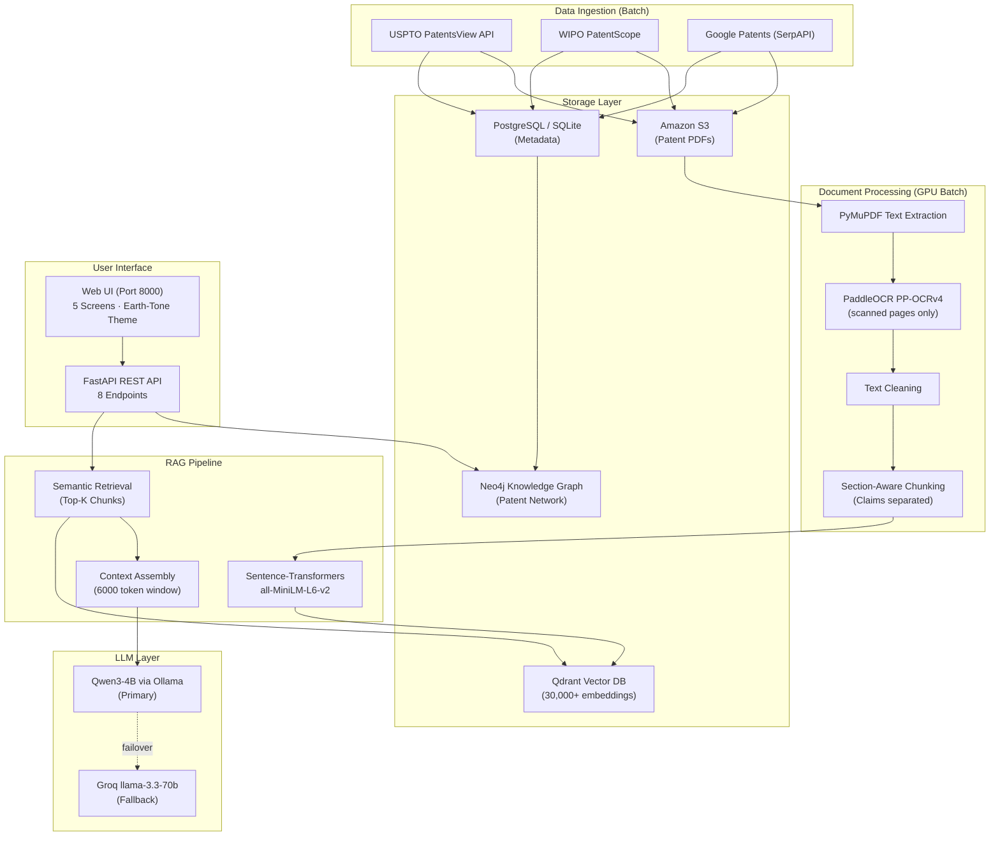

# PatentMind AI — Enterprise Patent Intelligence Platform

> **Big Data · RAG · Knowledge Graph · Dual LLM Fallback Engine**

PatentMind AI is an end-to-end patent intelligence system that collects, processes, semantically indexes, and queries 700+ AI/ML patents using a Retrieval-Augmented Generation (RAG) pipeline. It combines vector similarity search, knowledge graph traversal, and LLM synthesis to answer natural language questions about patent landscapes.

---

## Architecture



---

## Tech Stack

| Layer | Technology | Purpose |
|-------|-----------|---------|
| **Backend** | FastAPI 0.116.1 + Uvicorn | REST API & static file server |
| **LLM (Primary)** | Qwen3-4B / Qwen2.5:3b via Ollama | Local GPU inference |
| **LLM (Fallback)** | Groq API (llama-3.3-70b-versatile) | Cloud fallback when Ollama is down |
| **Vector DB** | Qdrant 1.9+ | 384-dim cosine similarity search |
| **Embeddings** | sentence-transformers all-MiniLM-L6-v2 | Patent chunk embeddings |
| **OCR** | PaddleOCR PP-OCRv4 | Scanned patent page extraction |
| **Relational DB** | PostgreSQL 15 / SQLite (fallback) | Patent metadata & audit logs |
| **Graph DB** | Neo4j 5 Community | Inventor/assignee/CPC knowledge graph |
| **PDF Storage** | Amazon S3 | Original patent PDF archive |
| **Frontend** | Vanilla HTML/CSS/JS | Single-page app, earth-tone palette |
| **Orchestration** | LangGraph + LangChain | RAG pipeline flow |

---

## Quick Start

### 1. One-Command Launch

```bash
# From project root — handles venv, service checks, and server launch
python start_all_services.py
```

This automatically:
- ✅ Detects/creates `.venv` and switches to it
- ✅ Initializes the database
- ✅ Checks Qdrant, Ollama, Neo4j connectivity
- ✅ Launches FastAPI on `http://localhost:8000`

### 2. With Batch Ingestion Worker

```bash
python start_all_services.py --worker
```

Scans S3 for new unindexed patents and processes them before starting the server.

### 3. Docker Compose

```bash
cd patentmind
docker-compose up --build
```

Starts PostgreSQL, Neo4j, and the FastAPI application.

---

## API Reference

| Method | Endpoint | Description |
|--------|----------|-------------|
| `POST` | `/api/query` | RAG pipeline query — returns LLM answer + cited sources |
| `POST` | `/api/query-with-paper` | Upload a research PDF + query for contextual analysis |
| `POST` | `/api/compare-pdf` | **Hero feature** — PDF novelty comparison (vector + graph + LLM) |
| `GET` | `/api/patents` | Paginated patent browser (filter by source, paginate) |
| `GET` | `/api/patents/{patent_number}` | Full metadata for a specific patent |
| `GET` | `/api/stats` | System statistics: patent counts, source breakdown, backends |
| `GET` | `/api/graph/patent/{pn}` | Neo4j knowledge graph neighborhood |
| `GET` | `/api/system-status` | Live service health check (Qdrant, Ollama, Neo4j, Groq) |

### Example Query

```bash
curl -X POST http://localhost:8000/api/query \
  -H "Content-Type: application/json" \
  -d '{"query": "What methods exist for training vision transformers on edge devices?"}'
```

**Response:**
```json
{
  "query_id": "a1b2c3d4",
  "query": "What methods exist for training vision transformers on edge devices?",
  "answer": "Several patents describe methods for edge deployment of vision transformers...",
  "sources": [
    {
      "patent_number": "US11893456",
      "section": "CLAIMS",
      "score": 0.87,
      "chunk_text": "Claim 1: A method for quantized inference..."
    }
  ],
  "llm_backend_used": "Qwen3-4B (Ollama GPU)",
  "vector_backend_used": "QDRANT"
}
```

---

## Fallback Architecture

PatentMind AI is designed for resilience. Every critical service has an automatic fallback:

```
┌──────────────────┐    ┌──────────────────┐
│  Ollama Qwen3-4B │───▶│  Groq Cloud API  │
│   (Primary LLM)  │ ↓  │ (Auto-Fallback)  │
└──────────────────┘    └──────────────────┘

┌──────────────────┐    ┌──────────────────┐
│  Qdrant Server   │───▶│  In-Memory       │
│ (Primary Vectors)│ ↓  │  Qdrant Client   │
└──────────────────┘    └──────────────────┘

┌──────────────────┐    ┌──────────────────┐
│  Neo4j Graph DB  │───▶│  Simulated Graph  │
│  (Primary Graph) │ ↓  │ (Empty Response)  │
└──────────────────┘    └──────────────────┘

┌──────────────────┐    ┌──────────────────┐
│ SentenceTransform │───▶│ DeterministicHash│
│  (Primary Embed) │ ↓  │   Encoder (CPU)  │
└──────────────────┘    └──────────────────┘
```

---

## Project Structure

```
Patent Basic/
├── start_all_services.py     # Master launcher (auto-venv, health checks)
├── gpu_worker.py             # Batch S3 → Qdrant ingestion worker
└── patentmind/
    ├── api/                  # FastAPI routes & middleware
    │   └── main.py           # All 8 endpoints
    ├── db/                   # SQLAlchemy models, Alembic migrations
    │   ├── models.py         # Patent, ProcessingLog, EmbeddingsMeta
    │   └── session.py        # Engine, session factory, init_db()
    ├── embeddings/           # Embedding generation & vector DB
    │   ├── encoder.py        # SentenceTransformer + hash fallback
    │   └── vector_store.py   # Qdrant client with fallback
    ├── retrieval/            # RAG pipeline
    │   └── rag_pipeline.py   # Query → Embed → Search → Context → LLM
    ├── llm/                  # LLM integration
    │   ├── ollama_client.py  # Qwen3-4B via Ollama REST
    │   ├── groq_client.py    # Groq API wrapper
    │   └── router.py         # Auto-failover LLM router
    ├── processing/           # Document processing pipeline
    │   ├── pdf_extractor.py  # PyMuPDF text extraction
    │   ├── ocr_engine.py     # PaddleOCR (GPU batch only)
    │   ├── cleaner.py        # Text cleaning & normalization
    │   └── chunker.py        # Section-aware patent chunking
    ├── ingestion/            # Patent data collection
    │   ├── uspto_client.py   # USPTO PatentsView API
    │   ├── wipo_client.py    # WIPO PatentScope API
    │   └── google_patents_client.py
    ├── graph/                # Knowledge graph
    │   └── neo4j_client.py   # Neo4j driver + fallback
    ├── storage/              # Cloud storage
    │   └── s3_client.py      # S3 upload/download with retry
    ├── frontend/dist/        # Built frontend (static HTML)
    │   └── index.html        # Single-page app (73KB)
    ├── tests/                # Test suites
    │   ├── test_patentmind.py
    │   ├── test_e2e_integration.py
    │   └── test_fallback_mechanisms.py
    ├── docs/
    │   └── DEPLOY.md         # Full deployment guide
    ├── docker-compose.yml    # PostgreSQL + Neo4j + API
    ├── Dockerfile            # Production container
    ├── requirements.txt
    └── .env.example
```

---

## Testing

```bash
# Run all tests
python -m pytest patentmind/tests/ -v

# E2E integration tests (requires running services)
python -m pytest patentmind/tests/test_e2e_integration.py -v

# Fallback mechanism tests (can run offline)
python -m pytest patentmind/tests/test_fallback_mechanisms.py -v
```

---

## GPU Server Rules

| Rule | Reason |
|------|--------|
| **Never** run PaddleOCR and Qwen3-4B simultaneously | OOM risk on 20GB VRAM |
| OCR is **batch-only** — never at query time | GPU memory budget |
| Embeddings run as a **separate batch** after OCR | Sequential GPU scheduling |
| Qdrant runs on **CPU** — no GPU needed | 0 GB VRAM used |

---

## License

This project is part of an academic/research initiative. See repository for details.

---

<p align="center">
  <strong>PatentMind AI</strong> · Built with FastAPI · Powered by Qwen3 & Groq · Vector search by Qdrant
</p>
